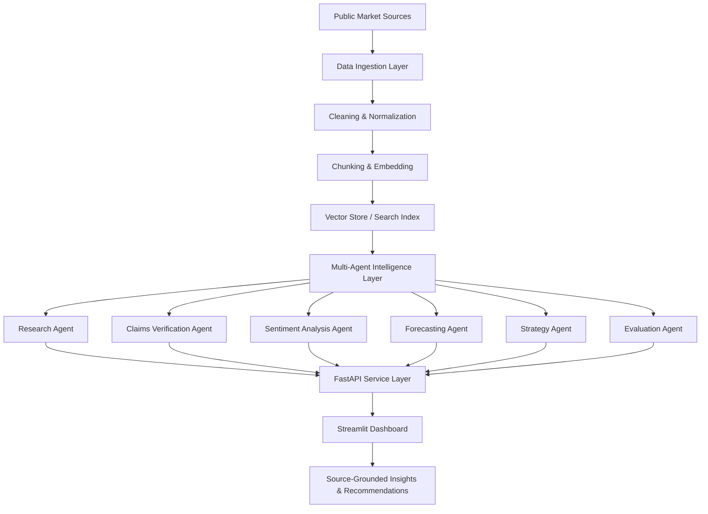

# Agentic Market Intelligence

A platform that combines **agentic workflows, RAG, forecasting, sentiment analysis, topic modeling and MLOps** to generate competitive intelligence from public market signals.

---

## What This System Does

The platform tales public market signals such as product pages, press releases, customer reviews, competitor claims, and pricing data. It then uses a multi-agent workflow to answer strategic business questions like:

> Which competitor products are gaining traction, what claims are they making, how is customer sentiment shifting and what should we do next?

---

## Architecture




---

## Core Agents

| Agent | Purpose |
|---|---|
| `ResearchAgent` | Retrieves and summarizes relevant market evidence. |
| `ClaimsAgent` | Extracts product claims, benefits and positioning. |
| `SentimentAgent` | Scores customer or market sentiment. |
| `ForecastAgent` | Forecasts trend direction from market signals. |
| `StrategyAgent` | Generates business recommendations. |
| `EvaluatorAgent` | Checks grounding, confidence and hallucination risk. |

---

## Example Output

```json
{
  "question": "Which competitor claims are gaining traction?",
  "recommendation": "Prioritize sustainability and sensitive-skin claims in upcoming messaging.",
  "evidence": [
    "Competitor A increased mentions of plant-based ingredients.",
    "Review sentiment improved after packaging relaunch.",
    "Search interest proxy rose for refillable product formats."
  ],
  "confidence": 0.82,
  "risk_flags": ["limited review sample size"]
}
```
---

## Portfolio Summary

I built an AI analyst that turns unstructured market signals into measurable product and strategy insights using agentic workflows, retrieval, forecasting, sentiment modeling and evaluation guardrails.
